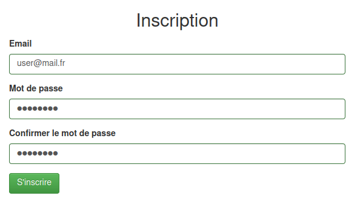
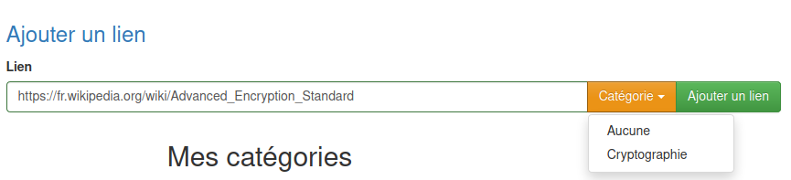
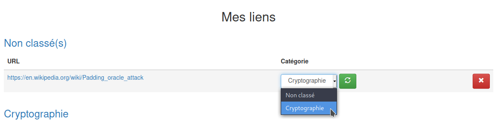
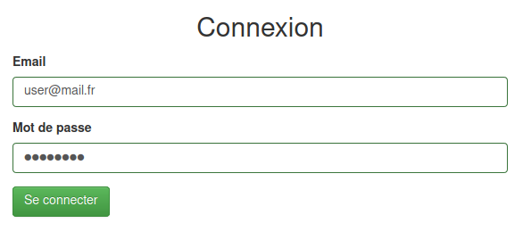

# Ollink

## Présentation

Ollink est une application de gestion de liens écrite en Node.js.

## Prérequis

* Nodejs (testé avec la version v12.18.4)
* MySQL (testé avec la version 0.3.24-MariaDB)

Le serveur MySQL doit écouter sur 127.0.0.1:3306. Vous pouvez changer cette configuration dans le fichier `models/sequelize.js`.

Vous pouvez configurer l'utilisateur de la base de données dans le fichier `models/sequelize.js`.

Création la base de données `ollink` :

    mysql -u root -p
    CREATE DATABASE ollink

## Utilisation

### Lancer le serveur

    node server.js

Par défaut, le serveur écoute sur localhost:8080. Vous pouvez changer cette configuration dans le fichier `server.js`.

### Inscription

Pour s'inscrire il suffit de fournir une adresse e-mail et un mot de passe. Bien entendu, vous pouvez entrer des informations factices, aucun email ne sera envoyé.

### Ajouter une catégorie

Saisir le nom de la catégorie et cliquer sur `+`

### Ajouter un lien

Pour ajouter un lien, il faut entrer le lien dans le champ, choisir une catégorie dans le liste et cliquer `Ajouter un lien`.

Par défaut, si aucune catégorie n'est choisie, le lien sera dans la catégorie "Non classé".

Il est possible de changer la catégorie d'un lien en choisissant la nouvelle catégorie et en appuaynt sur le bouton vert :

### Connexion

La connexion nécessite une adresse email et un mot de passe.

## Notes

Cette application a été développée durant mon temps libre dans le but d'apprendre le Node.js dans un cadre pratique.

Sentez-vous libre de le copier, de le modifier ou bien de le partager !
